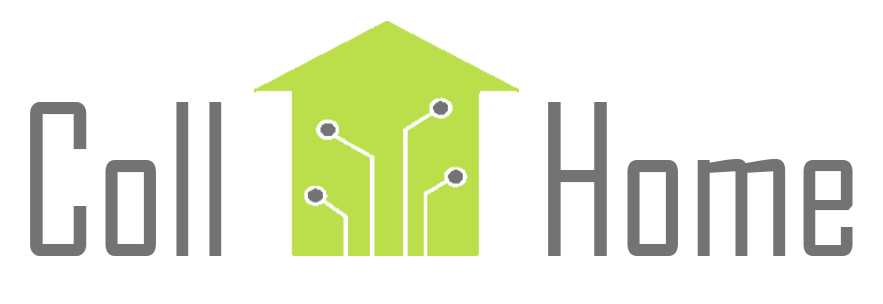

We are a student run volunteer organization devoted to helping caregivers and their loved ones.  We use our technological expertise to create and install personalized smart home device plans leveraging existing products.  We provide resources on common use cases that can be customized to caregiver’s needs.  Our goal is to give caregivers peace of mind through our continuous support.  Through this organization, college students connect with their greater communities and prepare to become caregivers themselves.

[Click Here for More Info](https://collhome.herokuapp.com/)